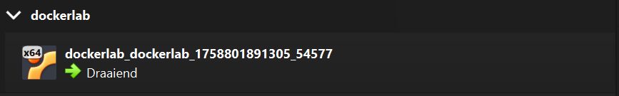
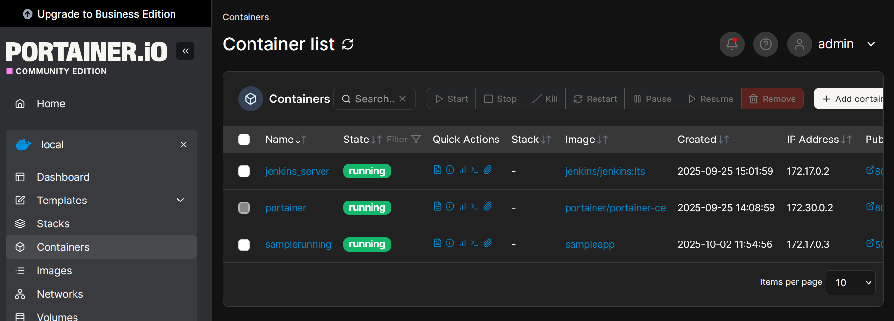
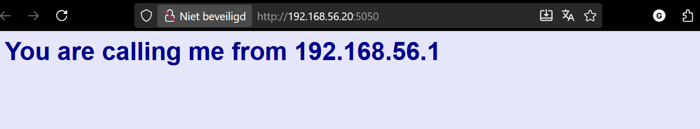

# Lab 1: Continuous Integration/Delivery with Jenkins

## Inleiding

Labopdracht om een CI/CD-pipeline te leren opzetten met Jenkins.

## Acceptance criteria

- [x] GitHub repository aangemaakt voor de sample-app
- [x] Applicatie succesvol draaien in de browser
- [x] Jenkins jobs zichtbaar in het dashboard
- [x] Wijziging aangebracht in de applicatie en gepusht naar GitHub
- [x] Build pipeline uitgevoerd en wijziging zichtbaar in browser
- [x] Labverslag en cheat sheet met screenshots en console output toegevoegd

## Opzetten van de labomgeving

Ik begon met het opzetten van de omgeving door de repo te clonen naar mijn laptop. Hierna heb ik de virtuele machine opgezet met vagrant. Hierbij liep ik eerst tegen een probleem aan met mijn host only adapter in virtualbox, maar dit heb ik opgelost door de adapter opnieuw te configureren. Vervolgens heb ik de VM gestart zonder provisioning en daarna de provisioning handmatig uitgevoerd met `vagrant provision`. Hierna werkte de opstelling zoals gewenst.



Een de VM was aangemaakt en deze draaide kon ik het portainer dashboard bereiken via:
<http://192.168.56.20:9000/>.



Hierna maakte ik de publieke repo aan op mijn github voor de files van de test app te bewaren. Deze repo is te vinden op: <https://github.com/DeMeerleerGilles/CI-CD-with-Jenkins>.

Hierna voerde ik het script: `sample-app.sh` uit om de sample app te draaien. Hierna was deze al te bereiken via: <http://192.168.56.20:5050/>.



## Jenkins configureren

Hierna zette ik een pipeline op in jenkins. Dit deed ik met de jenkinsfile uit de opgave.

<https://github.com/DeMeerleerGilles/CI-CD-with-Jenkins/blob/main/Jenkinsfile>

Na het aanmaken van de job moest ik de GitHub repository URL invullen bij Source Code Management. Dit is de URL van de repo die ik eerder had aangemaakt: <https://github.com/DeMeerleerGilles/CI-CD-with-Jenkins>.

Vanaf nu kon ik na elke nieuwe commit de build pipeline uitvoeren door in Jenkins op Build Now te klikken. Dit zorgde ervoor dat Jenkins de laatste versie van de code uit de GitHub repo haalde en de applicatie opnieuw bouwde en startte.


Om de applicatie te wijzigen, paste ik de volgende CSS code in het bestand `static/style.css`:

```css
body {
  background: black;
  font-family: sans-serif;
  color: white;
}
```

Hierna committe ik de wijziging en pushte ik deze naar GitHub. Vervolgens klikte ik in Jenkins op Build Now om de pipeline uit te voeren. Na de build was voltooid, verfriste ik de pagina van de sample app in mijn browser en zag ik dat de achtergrond nu zwart was.


## Kort overzicht van alle adressen

| Dienst     | Adres                        |
| ---------- | ---------------------------- |
| Sample app | <http://192.168.56.20:5050/> |
| Portainer  | <http://192.168.56.20:9000/> |
| Jenkins    | <http://192.168.56.20:8080/> |
