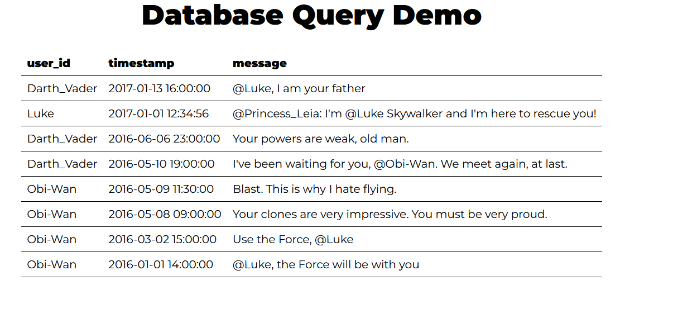

# Lab Report: Configuration Management with Ansible

DEMO: https://hogent.cloud.panopto.eu/Panopto/Pages/Viewer.aspx?id=b395f18d-8b2c-41f5-a2ea-b3b500d7646f

## Opzetten van de omgeving

Ik begon met het opzetten van de vagrant omgeving uit de opdracht door het uitvoeren van `vagrant up` in de terminal in de map vmlab.

Vragen uit de opdracht:

What is/are the IP addresses of this VM?

```bash
[vagrant@control ~]$ ip a
1: lo: <LOOPBACK,UP,LOWER_UP> mtu 65536 qdisc noqueue state UNKNOWN group default qlen 1000
    link/loopback 00:00:00:00:00:00 brd 00:00:00:00:00:00
    inet 127.0.0.1/8 scope host lo
       valid_lft forever preferred_lft forever
    inet6 ::1/128 scope host
       valid_lft forever preferred_lft forever
2: eth0: <BROADCAST,MULTICAST,UP,LOWER_UP> mtu 1500 qdisc fq_codel state UP group default qlen 1000
    link/ether 08:00:27:c7:88:3a brd ff:ff:ff:ff:ff:ff
    altname enp0s3
    inet 10.0.2.15/24 brd 10.0.2.255 scope global dynamic noprefixroute eth0
       valid_lft 86155sec preferred_lft 86155sec
    inet6 fd17:625c:f037:2:ea91:996f:18ac:a900/64 scope global dynamic noprefixroute
       valid_lft 86155sec preferred_lft 14155sec
    inet6 fe80::b8dc:61f0:3f5a:1893/64 scope link noprefixroute
       valid_lft forever preferred_lft forever
3: eth1: <BROADCAST,MULTICAST,UP,LOWER_UP> mtu 1500 qdisc fq_codel state UP group default qlen 1000
    link/ether 08:00:27:ed:ba:c4 brd ff:ff:ff:ff:ff:ff
    altname enp0s8
    inet 172.16.128.253/16 brd 172.16.255.255 scope global noprefixroute eth1
       valid_lft forever preferred_lft forever
    inet6 fe80::a00:27ff:feed:bac4/64 scope link
       valid_lft forever preferred_lft forever
```

Check the VirtualBox network adapters of the VM and see if you can match the IP addresses with the VirtualBox adapter.

De NAT adapter heeft uiteraard het standaard IP adres dat hij altijd van virtualbox krijgt, namelijk 10.0.2.15. De tweede adapter is een host-only adapter en heeft het IP adres 172.16.128.253.

Which Linux distribution are we running (command lsb_release -a or cat /etc/redhat-release)? Find some information about this distro!

```bash
[vagrant@control ~]$ cat /etc/redhat-release
AlmaLinux release 9.5 (Teal Serval)
```

De versie die geinstalleerd staat is AlmaLinux 9.5. 

What version of the Linux kernel is installed (uname -a)?

```bash
[vagrant@control ~]$ uname -a
Linux control 5.14.0-503.23.2.el9_5.x86_64 #1 SMP PREEMPT_DYNAMIC Wed Feb 12 05:52:18 EST 2025 x86_64 x86_64 x86_64 GNU/Linux
```

Van de Linux kernel is versie 5.14.0-503.23.2.el9_5.x86_64 geinstalleerd.

What version of Ansible is installed?

```bash
[vagrant@control ~]$ ansible --version
ansible [core 2.15.13]
  config file = None
  configured module search path = ['/home/vagrant/.ansible/plugins/modules', '/usr/share/ansible/plugins/modules']
  ansible python module location = /home/vagrant/.local/lib/python3.9/site-packages/ansible
  ansible collection location = /home/vagrant/.ansible/collections:/usr/share/ansible/collections
  executable location = /home/vagrant/.local/bin/ansible
  python version = 3.9.21 (main, Dec  5 2024, 00:00:00) [GCC 11.5.0 20240719 (Red Hat 11.5.0-2)] (/usr/bin/python3)
  jinja version = 3.1.6
  libyaml = True
```

Van Ansible is versie 2.15.13 geinstalleerd.

Check the contents of the direcory /vagrant/.

```bash
[vagrant@control vagrant]$ ls
ansible  LICENSE  README.md  scripts  test  Vagrantfile  vagrant-hosts.yml
```

### Opzetten van een managed node

Ik voegde het stukje uit de opgave toe aan de vagrant hosts file om de nieuwe managed node bij te maken.

Bij het uitvoeren van een vagrant status zag ik dat de nieuwe VM aangemaakt was:

```bash
PS C:\Users\gille\OneDrive\Documents\GitHub\infra-2526-DeMeerleerGilles\vmlab> vagrant status
Current machine states:

control                   running (virtualbox)
srv100                    not created (virtualbox)
```

De vagrant start succesvol en ik kan een ssh verbinding opzetten.

Bij het uitvoeren van de ping via ansible kreeg ik een error:

```bash
srv100 | FAILED! => {
    "msg": "Using a SSH password instead of a key is not possible because Host Key checking is enabled and sshpass does not support this.  Please add this host's fingerprint to your known_hosts file to manage this host."
}
```

Dit probleem heb ik opgelost door de host key van srv100 toe te voegen aan de known_hosts file met het commando:

```bash
[vagrant@control ~]$ ssh-keyscan -H 172.16.128.100 >> ~/.ssh/known_hosts
```

(Gevonden via Github copilot AI)

Hierna werkte de ping succesvol:

```bash
[vagrant@control ansible]$ ansible -i inventory.yml -m ping srv100
srv100 | SUCCESS => {
    "ansible_facts": {
        "discovered_interpreter_python": "/usr/bin/python3"
    },
    "changed": false,
    "ping": "pong"
}
```

###  Applying a role to a managed node

Ik paste het volgende aan in ansible/site.yml en voerde de stappen uit de opdracht uit om de rol van meneer Van Vreckem te installeren.

```yaml
---
- name: Configure srv100 # Each task should have a name
  hosts: srv100          # Indicates hosts this applies to (host or group name)
  roles:                 # Enumerate roles to be applied
    - bertvv.rh-base
```

 What is the name of this property that after the first run, the operation does not change the target system anymore?

 Dit is idempotentie.

 Ik maakte het servers.yml bestand aan en plakte de inhoud uit de opgave erin. Hierana voerde ik het playbook uit met het commando:

```bash
[vagrant@control ansible]$ ansible-playbook -i inventory.yml site.yml
```

Om ervoor te zorgen dat de andere packages ook geïnstalleerd werden, voegde ik de volgende regels toe aan het bestand servers.yml:

```yaml
# ansible/group_vars/servers.yml
---
rhbase_repositories:
  - epel-release
rhbase_install_packages:
  - bash-completion
  - vim-enhanced
  - bind-utils
  - git
  - nano
  - setroubleshoot-server
  - tree
  - wget

```

Na het uitvoeren van het playbook werden alle packages succesvol geïnstalleerd.

Nu moest ik van de opdracht een nieuwe gebruiker voor mezelf aanmaken, in de documentatie vond ik hiervoor:
rhbase_users 	[] 	List of dicts specifying users that should be present. See below for an example.

Ik voegde de volgende regels toe aan het bestand servers.yml:

```yaml
# ansible/group_vars/servers.yml
---
rhbase_repositories:
  - epel-release
rhbase_install_packages:
  - bash-completion
  - vim-enhanced
  - bind-utils
  - git
  - nano
  - setroubleshoot-server
  - tree
  - wget

rhbase_users:
  - name: gillesdm
    comment: "Gilles De Meerleer"
    groups: 
      - wheel
    shell: /bin/bash

rhbase_authorized_keys:
  - user: gillesdm
    key: "{{ ssh_key }}"
```

Ik voegde ook de ssh key toe aan group_vars/all.yml zoals gevraagd in de opdracht:

### Web applicatie server

Ik maakte de volgende aanpassingen in host_vars/srv100.yml:

link naar de file:

```yaml
# ansible/host_vars/srv100.yml
---

# Voeg de bestaande rhbase_install_packages toe uit servers.yml (bv. vim, bash-completion, ...)
rhbase_install_packages:
  - httpd
  - mod_ssl
  - mariadb-server
  - php
  - php-mysqlnd
  - php-cli

# Services die moeten draaien
rhbase_services:
  - name: mariadb
    state: started
    enabled: true
  - name: httpd
    state: started
    enabled: true

# Firewall configuratie (enkel web naar buiten)
rhbase_firewall_allow_services:
  - http
  - https

# Database variabelen
db_name: appdb
db_user: appuser
db_password: "let me in"
```

Ook de site.yml paste ik aan:

```yaml
  # ansible/site.yml
---

- name: Configure srv100
  hosts: srv100
  become: true

  roles:
    - bertvv.rh-base

  tasks:
    - name: Copy database creation script
      ansible.builtin.copy:
        src: files/db.sql
        dest: /tmp/db.sql
        owner: root
        group: root
        mode: '0644'

    - name: Install PHP script
      ansible.builtin.copy:
        src: files/test.php
        dest: /var/www/html/index.php
        owner: apache
        group: apache
        mode: '0644'

    - name: Ensure Apache is running and enabled
      ansible.builtin.service:
        name: httpd
        state: started
        enabled: true

    - name: Create database
      community.mysql.mysql_db:
        name: "{{ db_name }}"
        state: import
        target: /tmp/db.sql
        login_unix_socket: /var/lib/mysql/mysql.sock

    - name: Create database user
      community.mysql.mysql_user:
        name: "{{ db_user }}"
        password: "{{ db_password }}"
        priv: "{{ db_name }}.*:ALL"
        state: present
        login_unix_socket: /var/lib/mysql/mysql.sock

```

Hiena kon het playbook succesvol uitgevoerd worden en werkte de webserver naar behoren.



#### SSL certificaat

Ik genereerde zelf een self-signed certificaat met het volgende commando:

```bash
sudo mkdir -p /etc/pki/tls/{certs,private}
sudo openssl genrsa -out /etc/pki/tls/private/server.key 2048
sudo openssl req -new -x509 -key /etc/pki/tls/private/server.key \
  -out /etc/pki/tls/certs/server.crt -days 365 \
  -subj "/C=BE/ST=Oost-Vlaanderen/L=Gent/O='hogent/CN=srv100"

```

Ik kopieerde de bestanden server.key en server.crt naar de map vmlab/ansible/files en voegde de volgende regels toe aan host_vars/srv100.yml:

```bash
[vagrant@srv100 /]$ sudo mkdir -p /vagrant/ansible/files
sudo cp /etc/pki/tls/certs/server.crt /vagrant/ansible/files/
sudo cp /etc/pki/tls/private/server.key /vagrant/ansible/files/
```

```yaml
httpd_ssl_certificate_file: 'server.crt'
httpd_ssl_certificate_key_file: 'server.key'
```

### Idenmpotentie

Om ervoor te zorgen dat de databank niet elke keer opnieuw aangemaakt wordt, voegde ik een when statement toe aan de taak Create database in site.yml:

```yaml
    - name: Copy database creation script
  ansible.builtin.copy:
    src: files/db.sql
    dest: /tmp/db.sql
    owner: root
    group: root
    mode: '0644'
  register: db_sql_copy

- name: Create database
  community.mysql.mysql_db:
    name: "{{ db_name }}"
    state: import
    target: /tmp/db.sql
    login_unix_socket: /var/lib/mysql/mysql.sock
  when: db_sql_copy.changed

```

### DNS

Ik maakte de nieuwe VM aan met vagrant volgens de stappen uit de opdracht. Hierop liet ik de bind service draaien via de rol van meneer Van Vreckem. 

Eerst installeerde ik de ansible roles via ansible-galaxy:

```bash
ansible-galaxy install -r requirements.yml
```

Daarna paste ik de playbook aan in site.yml:

```yaml
- name: Configure DNS primary server
  hosts: srv001
  become: true
  roles:
    - bertvv.rh-base
    - bertvv.bind

- name: Configure DNS secondary server
  hosts: srv002
  become: true
  roles:
    - bertvv.rh-base
    - bertvv.bind

```

In de host_vars/srv001.yml voegde ik de volgende regels toe:

```yaml
# base packages
rhbase_install_packages:
  - bind-utils

bind_allow_query: ['any']
bind_recursion: true
bind_forward_only: true
bind_forwarders:
  - 193.190.173.1
  - 193.190.173.3

bind_zones:
  - name: "infra.lan"
    type: primary
    allow_transfer:
      - 172.16.128.2
    primaries:
      - 172.16.128.1
    name_servers:
      - ns1.infra.lan.
      - ns2.infra.lan.
    hosts:
      - name: ns1
        ip: 172.16.128.1
      - name: ns2
        ip: 172.16.128.2
      - name: www
        ip: 172.16.128.100
    networks:
      - '172.16.128'

```

Nu moest ik enkel nog de playbook uitvoeren en werkte de DNS server naar behoren.

Dieet ik door het commando:

```bash
[vagrant@control ansible]$ ansible-playbook -i inventory.yml site.yml
```

Ik kreeg deze error bij het uitvoeren van de playbook:

```bash
TASK [bertvv.bind : Check `primaries` or `forwarders` was set for each zone] ***************************************************
failed: [srv001] (item=infra.lan) => {"ansible_loop_var": "item", "assertion": "item.primaries is defined or item.forwarders is defined", "changed": false, "evaluated_to": false, "item": {"allow_transfer": ["172.16.128.2"], "file": "db.infra.lan", "hosts": {"ns1": "172.16.128.1", "ns2": "172.16.128.2", "www": "172.16.128.100"}, "name": "infra.lan", "zone_type": "master"}, "msg": "Assertion failed"}

PLAY RECAP *********************************************************************************************************************
srv001                     : ok=34   changed=0    unreachable=0    failed=1    skipped=16   rescued=0    ignored=0
```

Hierna ging ik verder met server 002 op te zetten als een secundaire DNS server. Deze server gaf opnieuw de fout op de keys, dus deze diende ik opnieuw toe te voegen via het keyscan commando.

```bash
[vagrant@control ~]$ ssh-keyscan -H 172.16.128.2 >> ~/.ssh/known_hosts
```

Alles van DNS is nu geinstalleerd op srv001 en srv002, ik voerde nog enkele basis testen uit om te zien of alles werkte zoals het moest.

Dit deed ik door eerst te kijken of de bind DNS de requests beantwoord:

```bash
systemctl status named
```

Deze was zowel op srv001 als 002 actief:

```bash
 named.service - Berkeley Internet Name Domain (DNS)
     Loaded: loaded (/usr/lib/systemd/system/named.service; enabled; preset: disabled)
     Active: active (running) since Thu 2025-10-30 10:42:31 UTC; 18min ago
    Process: 8623 ExecStartPre=/bin/bash -c if [ ! "$DISABLE_ZONE_CHECKING" == "yes" ]; then /usr/sbin/named-checkconf -z "$NAMEDCON>
    Process: 8626 ExecStart=/usr/sbin/named -u named -c ${NAMEDCONF} $OPTIONS (code=exited, status=0/SUCCESS)
    Process: 8976 ExecReload=/bin/sh -c if /usr/sbin/rndc null > /dev/null 2>&1; then /usr/sbin/rndc reload; else /bin/kill -HUP $MA>
   Main PID: 8627 (named)
      Tasks: 10 (limit: 18768)
     Memory: 31.1M
        CPU: 187ms
     CGroup: /system.slice/named.service
             └─8627 /usr/sbin/named -u named -c /etc/named.conf
```

Nu kon ik de DNS server met success gebruiken:

```bash
; <<>> DiG 9.16.23-RH <<>> @172.16.128.1 www.infra.lan
; (1 server found)
;; global options: +cmd
;; Got answer:
;; ->>HEADER<<- opcode: QUERY, status: NOERROR, id: 31693
;; flags: qr aa rd ra; QUERY: 1, ANSWER: 1, AUTHORITY: 0, ADDITIONAL: 1

;; OPT PSEUDOSECTION:
; EDNS: version: 0, flags:; udp: 1232
; COOKIE: 36c6f056076236ef01000000690c7cece296550288bdcfc0 (good)
;; QUESTION SECTION:
;www.infra.lan.                 IN      A

;; ANSWER SECTION:
www.infra.lan.          604800  IN      A       172.16.128.100

;; Query time: 0 msec
;; SERVER: 172.16.128.1#53(172.16.128.1)
;; WHEN: Thu Nov 06 10:48:12 UTC 2025
;; MSG SIZE  rcvd: 86
```

### DHCP

Hierna ging ik verder met het instellen van de DHCP server.

Ik maakte ook hiervoor een nieuwe VM aan, via de DHCP rol van meneer Van Vreckem stelde ik dan de juiste pools in.

## Router

Ik had geen toegang tot de ISO of de OVA van Cisco, dus ik maakte de 2.7-opdracht als alternatief.

Ik maakte de nieuwe VyOS VM aan met Vagrant. Na het opstarten controleerde ik de interfaces met het commando show interfaces en bevestigde dat de IP-adressen overeenkwamen met de lab-opdracht. De LAN-interface had het IP-adres 172.16.255.254 en de WAN-interface was correct ingesteld.

Vervolgens configureerde ik de router met Ansible. Ik voegde de VyOS-VM toe aan de Ansible-inventory onder de groep routers en testte eerst de connectiviteit met het ping-module en het ophalen van facts met vyos_facts. Na installatie van de VyOS-collectie in Ansible herkende de modules zoals vyos_interface, vyos_system en vyos_nat correct.

Het playbook bevatte de volgende stappen:

Het instellen van de hostnaam van de router.

Het configureren van de LAN-interface (eth1) met IP-adres en beschrijving.

Het toevoegen van een beschrijving voor de WAN-interface (eth0).

Het inschakelen van NAT voor verkeer van LAN naar WAN.

Het configureren van port forwarding voor HTTP en HTTPS verkeer naar de interne server.

Na het uitvoeren van het playbook controleerde ik dat alle instellingen correct waren toegepast en dat de configuratie persistent bleef na een reboot van de VM. De router functioneerde zoals verwacht en was volledig beheerd via Ansible, waarmee de labopdracht succesvol werd afgerond.

Ik kon eerst geen verbinding maken met de router vanaf de controller omdat het adres in een ander subnet lag

## Resources

List all sources of useful information that you encountered while completing this assignment: books, manuals, HOWTO's, blog posts, etc.

- Ansible documentatie: <https://docs.ansible.com/>